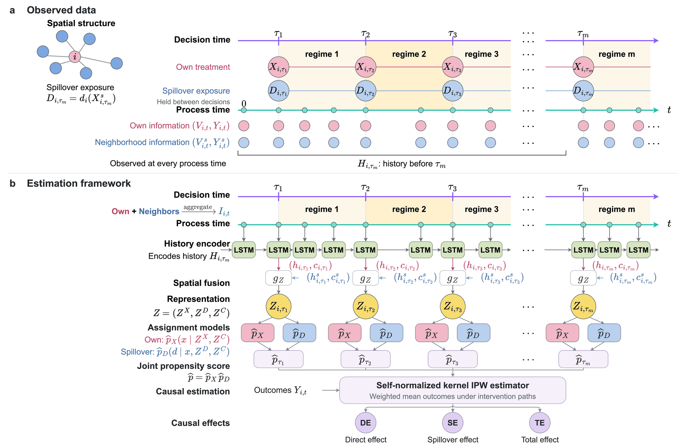
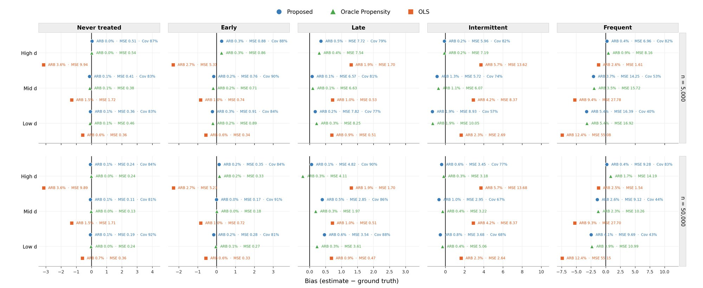

<h1 align="center">When Treatments Spill Over</h1>

<p align="center">
  <b>A Neural Framework for Spatiotemporal Causal Effect Estimation</b><br>
  Shaohui Zhang, Jiasheng Shi, Jing Huang
</p>

<p align="center">
  
</p>
<p><sub><b>Figure 1.</b> (a) Covariates and outcomes are observed at every process time, while a unit's own treatment and its neighbourhood spillover exposure change only at decision times. (b) An LSTM summarizes each unit's history, <i>g<sub>Z</sub></i> combines it with the neighbours' recurrent states, and the resulting representations feed the own-treatment and spillover assignment models. A self-normalized kernel IPW estimator then gives the direct, spillover and total effects.</sub></p>

This repository accompanies the paper. In the proposed framework, a unit's
potential outcomes are indexed by its own treatment path and by the spillover
exposure path of its neighbourhood. An LSTM encoder summarizes the growing
histories of the unit and its neighbours, and a self-normalized kernel IPW
estimator built on these summaries recovers direct, spillover and total
effects. The repository also contains the code for the simulation study, the
sensitivity analysis for unmeasured confounding, and the county-level COVID-19
policy application.

## Installation

The code needs Python 3.10 or later.

```bash
git clone https://github.com/JuniperZhang/Causal_spillover_temporal.git
```

```bash
cd Causal_spillover_temporal
```

```bash
pip install -r model/requirements.txt
```

All commands below are run from the repository root and write to `results/`.
To check the installation, the following runs the whole sensitivity pipeline
on a tiny network in about a minute (its numbers have no meaning):

```bash
python -m model.pipeline.run_sensitivity --smoke --out-dir results/smoke
```

## Simulation study

The data-generating process is the one described in the paper. Units sit on an Erdős–Rényi
network with mean degree 6 and are followed for 20 process times, with ten
time-varying covariates and binary treatment decisions at τ = 1, 6, 11 and
16. Spillover exposure is the proportion of treated neighbours. Each run
compares the proposed estimator with two benchmarks, the same estimator
using the true propensity score and an outcome regression (OLS), for 15 mean
potential outcomes (five own-treatment paths crossed with three reference
spillover paths) and the 13 direct, spillover and total effects built from
them. The defaults in `model/config.py` reproduce the paper's design.

The main results use R = 100 replications at n = 5,000 and n = 50,000, with
bandwidth h = 0.03 and 100 network-block bootstrap resamples per replication.
The larger network is much faster on a GPU.

```bash
python -m model.pipeline.bias_mse_study --n 5000 --R 100 --bandwidth 0.03 --reference-paths-json model/sensitivity_reference_paths.json --n-workers 8 --out results/sim_n5000_h003.json
```

```bash
python -m model.pipeline.bias_mse_study --n 50000 --R 100 --bandwidth 0.03 --reference-paths-json model/sensitivity_reference_paths.json --device cuda --n-workers 1 --out results/sim_n50000_h003.json
```

Figure 2 is drawn from these two runs:

```bash
python -m model.visualization.mean_potential_outcome results/sim_n5000_h003.json results/sim_n50000_h003.json results/mean_potential_outcome.jpg --fixed-model
```

<p align="center">
  
</p>
<p><sub><b>Figure 2.</b> Bias of the proposed estimator, the oracle-propensity estimator and OLS for the 15 mean potential outcomes at n = 5,000 (top) and n = 50,000 (bottom), with absolute relative bias (ARB), MSE and bootstrap coverage beside each estimate.</sub></p>

Averaged over the 13 causal effects, the proposed estimator stays close to its
oracle-propensity counterpart, while OLS remains biased as n grows:

| | n = 5,000 | n = 50,000 |
|---|---|---|
| Mean ARB, proposed | 0.073 | 0.048 |
| Mean ARB, oracle propensity | 0.074 | 0.047 |
| Mean ARB, OLS | 0.303 | 0.303 |
| Average MSE, proposed | 8.335 | 5.384 |
| Average MSE, OLS | 8.88 | 8.88 |

The Supplementary Material adds two sets of runs at n = 5,000. For the
bandwidth comparison, repeat the first command with `--bandwidth 0.02`, `0.04`
or `0.05`. The stress tests replace the latent-outcome equation with one of
three alternatives, `burden_modified` (DGP A), `own_spillover_synergy` (DGP B)
and `burden_synergy` (DGP C), each with 20 replications; for DGP A:

```bash
python -m model.pipeline.bias_mse_study --n 5000 --R 20 --bandwidth 0.03 --dgp-variant burden_modified --latent-beta-xd 4.0 --treatment-variant baseline --reference-paths-json model/stress_test_reference_paths.json --out results/stress_A.json
```

Long runs can be split across jobs with `--rep-start` and `--rep-count`,
each job writing its own `--out` file, and merged afterwards with
`python -m model.pipeline.merge_bias_mse_shards`. A run that stops early
resumes with `--resume` and the same arguments.

## Sensitivity analysis

The sensitivity analysis bounds each estimate when, because of
unmeasured confounding, the true assignment density at each decision time may
differ from the one implied by the observed history by a factor of up to Γ. The runner fixes the design used in the paper
(M = 4, h = 0.03, R = 100 and Γ from 1 to 5) and writes
`results/sensitivity_n{n}_R100/study.json`. Adding `--dry-run` prints the
design without running anything.

```bash
python -m model.pipeline.run_sensitivity --n 5000 --device cpu --n-workers 8
```

```bash
python -m model.pipeline.run_sensitivity --n 50000 --device cuda
```

The n = 50,000 study takes about 40 hours on a single A100 GPU. It can be
split with `--rep-start`, `--rep-count` and `--out-dir` and merged with
`python -m model.pipeline.merge_sensitivity_shards`. The figures comparing the
two sample sizes are drawn with

```bash
python -m model.visualization.sensitivity_comparison --studies results/sensitivity_n5000_R100/study.json results/sensitivity_n50000_R100/study.json --out results/sensitivity_figures
```

Every script accepts `--help`.

## COVID-19 policy application

The paper applies the method to state COVID-19 policies and later county case
rates in 3,108 counties, with weekly outcomes and monthly policy decisions from
April to October 2020. Two policy domains are analysed, business and economic
restrictions and education and childcare. The point estimates average 100
refits of the assignment models, and the 95% intervals pool their
network-block bootstrap draws.

Only a few rows of the data are included, in `model/real_data/sample_data/`, to show
the format; the full data are available from the corresponding author on
reasonable request. [`model/real_data/README.md`](model/real_data/README.md) describes the variables, the
analysis steps and the settings used in the paper.

## Code layout

```text
model/
├── config.py                  simulation design and model hyperparameters
├── data/
│   ├── generation.py          data-generating equations
│   ├── dataset.py             one simulated network with its unit histories
│   ├── ground_truth.py        Monte Carlo ground truth for the target paths
│   └── real_data_dataset.py   county panel for the application
├── models/                    LSTM encoder, g_Z and the assignment models f_X, f_D
├── training/                  joint training of the encoder and assignment models
├── estimation/
│   ├── gaussian_kernel.py     self-normalized kernel IPW estimator
│   ├── oracle.py              the same estimator with the true propensity score
│   ├── ols_baseline.py        outcome-regression benchmark
│   ├── bootstrap.py           network-block bootstrap
│   └── sensitivity.py         sensitivity bounds
├── pipeline/                  simulation and sensitivity runners
├── visualization/             figure scripts
└── real_data/                 COVID-19 application: data sample and analysis scripts
```

## Citation

```bibtex
@article{zhang2026treatments,
  title  = {When Treatments Spill Over: A Neural Framework for Spatiotemporal Causal Effect Estimation},
  author = {Zhang, Shaohui and Shi, Jiasheng and Huang, Jing},
  year   = {2026},
  note   = {Manuscript}
}
```

## License

Released under the MIT License; see [LICENSE](LICENSE).
